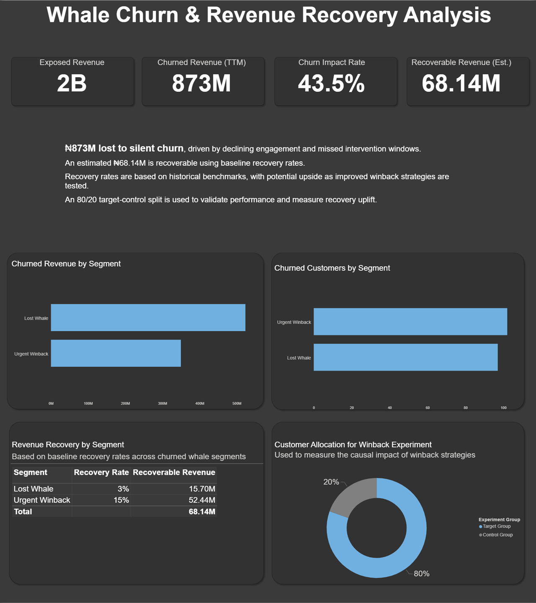
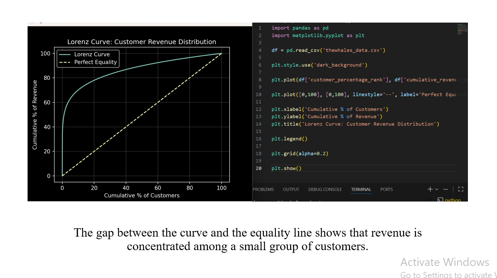
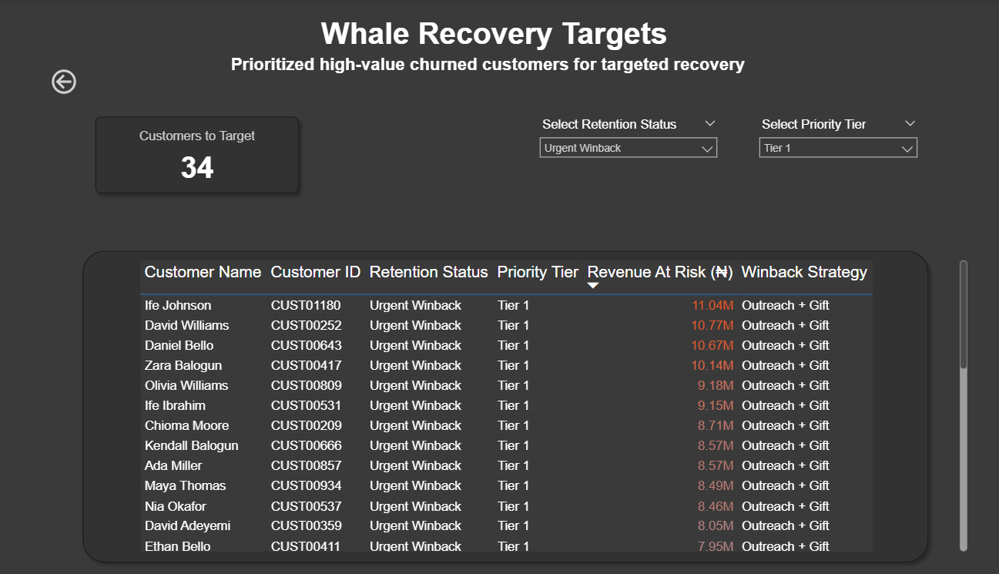

# Whale Churn & Revenue Recovery Analysis

## Problem Statement
Revenue growth was underperforming despite strong customer acquisition.

Further analysis revealed a critical risk:
- High-value customers ("whales") were quietly churning
- A significant share of total revenue is concentrated among these customers
- This has already resulted in ₦873M in lost revenue within this segment

## Objective
Build a data-driven framework to:
- Identify high-value customers
- Detect churn based on inactivity
- Quantify revenue loss (TTM)
- Prioritize recovery opportunities
- Design measurable winback strategies

## Dashboard Overview
This dashboard quantifies:
- Total exposed revenue
- Revenue lost to churn
- Churn impact rate
- Estimated recoverable revenue


> KPI view showing exposed revenue, churn impact, and estimated recovery opportunity.

## Methodology
### The analysis was conducted in a structured pipeline:
### 1. Customer Value Identification
Computed lifetime revenue per customer to identify high-value segments

```sql
SELECT 
    customerkey,
    SUM(net_revenue) AS lifetime_revenue
FROM
    sales
GROUP BY
    customerkey;
```
### 2. Pareto Analysis (80/20 Rule)
Validated revenue concentration using cumulative revenue distribution

```sql
SUM(lifetime_revenue) OVER(
        ORDER BY lifetime_revenue DESC
    ) AS running_lifetime_revenue,
SUM(lifetime_revenue) OVER() AS total_revenue,
ROW_NUMBER() OVER(
        ORDER BY lifetime_revenue DESC
    ) AS customer_rank,
COUNT(*) OVER() AS total_customer_count
```
```sql
100 * (running_lifetime_revenue / total_revenue) AS cumulative_revenue_pct,
100 * (customer_rank :: FLOAT / total_customer_count) AS customer_percentage_rank,
CASE
    WHEN (running_lifetime_revenue / total_revenue) <= 0.8
        THEN 'Top Revenue Drivers'
    ELSE 'Long Tail'
END AS pareto_segment
```

> Confirms that a small percentage of customers drives a disproportionate share of total revenue.

### 3. Churn Segmentation
Customers were segmented based on inactivity:
- Urgent Winback - Recently churned, high recovery potential
- Lost Whale - Long inactive, low recovery probability
- Active Whale - Currently engaged, no immediate risk

```sql
CASE
    WHEN DATE '2026-01-01' - last_orderdate BETWEEN 181 AND 540
        THEN 'Urgent Winback'
    WHEN DATE '2026-01-01' - last_orderdate >= 541
        THEN 'Lost Whale'
    ELSE 'Active Whale'
END AS 
    retention_status
```

### 4. Churned Revenue (TTM)
Measured revenue loss over the last 12 months relative to each customer's last activity

```sql
SUM(
    CASE WHEN order_date >= last_orderdate - INTERVAL '12 Months'
            THEN net_revenue 
        ELSE 0 
    END) AS churned_revenue
```

### 5. Priority Ranking
Customers were ranked within each segment using revenue impact to focus intervention on the highest-value opportunities.

```sql
NTILE(3) OVER (
    PARTITION BY retention_status
    ORDER BY churned_revenue DESC
) AS bucket
```

### 6. Winback Strategy Mapping
Each segment was mapped to a targeted recovery action:
- Urgent Winback - Personalized outreach + courtesy gift
- Lost Whale - Personalized outreach + tailored reactivation offer
- Active Whale - No action required

```sql
CASE
    WHEN retention_status = 'Urgent Winback'
        THEN 'Personalized Outreach + Courtesy Gift'
    WHEN retention_status = 'Lost Whale'
        THEN 'Personalized Outreach + Tailored Reactivation Offer'
    ELSE 'No Action required'
END AS 
     winback_strategy
```

### 7. Experiment Design (A/B Testing)
Customers were randomly assigned into:
- Target Group (80%) - Receives winback intervention
- Control Group (20%) - No intervention

This enables measurement of the causal impact of winback strategies.

```sql
CASE
    WHEN NTILE(5) OVER (
        PARTITION BY retention_status
        ORDER BY RANDOM()
    ) IN (1, 2, 3, 4) THEN 'Target Group'
    ELSE 'Control Group'
END AS experiment_group
```


> Displays high-priority customers selected for winback intervention.

## Key Insights
- Revenue is highly concentrated, with the top 17% of customers contributing 80% of total revenue, making churn within this segment disproportionately costly
- ₦873M (43.5%) in revenue has been lost due to silent churn among high-value customers
- Churn is primarily driven by declining engagement and missed intervention windows
- ₦68.14M represents baseline recoverable revenue based on historical recovery benchmarks


## Operational Recommendations
-  Prioritize Tier 1 "Urgent Winback" customers to maximize immediate revenue recovery impact
-  Deploy targeted winback strategies across high-value churn segments to capture incremental recovery beyond the baseline
- Measure incremental recovery uplift and validate strategy effectiveness using an 80/20 test-control framework
- Continuously optimize winback interventions based on observed performance and uplift results


## Tools & Technologies
- SQL - Data transformation, segmentation, and analysis
- Power BI - Dashboard development and visualization
- Python (Matplotlib/Pandas) - Lorenz Curve and supporting analysis
